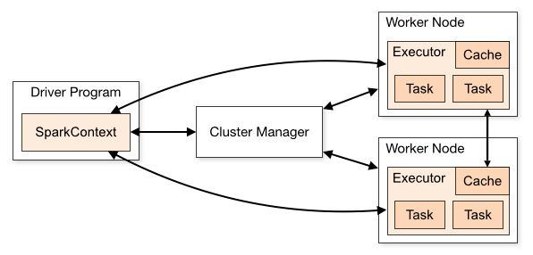
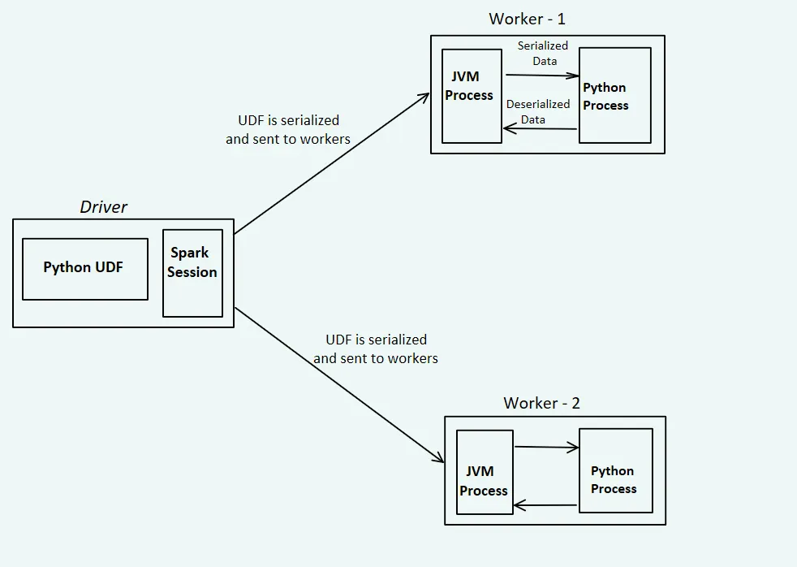

# 1. Czym jest Apache Spark i jakie problemy rozwiązuje

# 2. Architektura Spark



# 3. Czym jest PySpark?



# 4. Lazy evaluation

Przykłady transformacji:
```python
select()
filter()
withColumn()
groupBy()
join()
orderBy()
```

Przykłady akcji:
```python
show()
count()
collect()
first()
take()
write()
```

# 5. Job vs Stage vs Task

```
Spark Application
       │
       └── Job
            │
            ├── Stage 0
            │      ├── Task
            │      ├── Task
            │      ├── Task
            │      └── Task
            │
            └── Stage 1
                   ├── Task
                   ├── Task
                   ├── Task
                   └── Task
```

# 6. Podstawowe pojecia:

1. Driver
2. Cluster Manager
3. Worker node
4. Executor
5. Task
6. Job
7. Stage
8. Partition
9. Akcja
10. Transformacja
11. Lazy evaluation
12. Shuffle