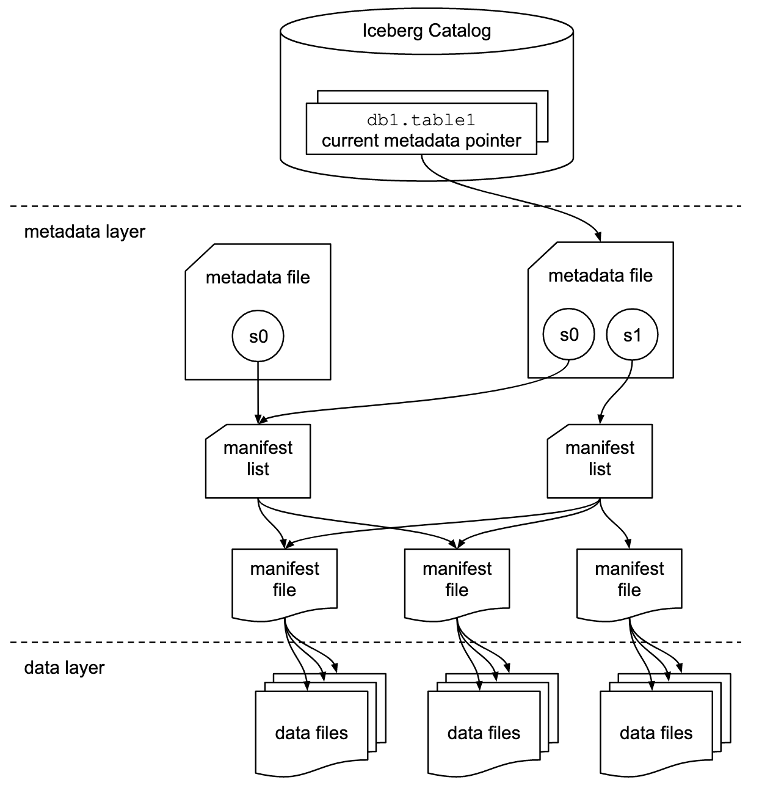
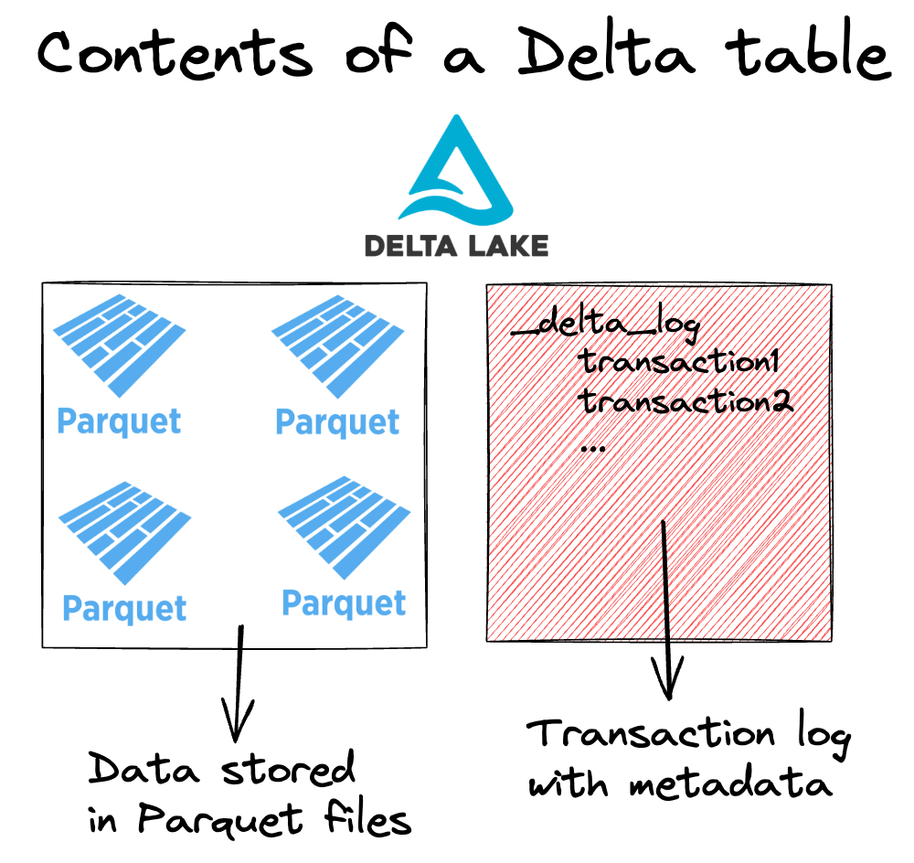
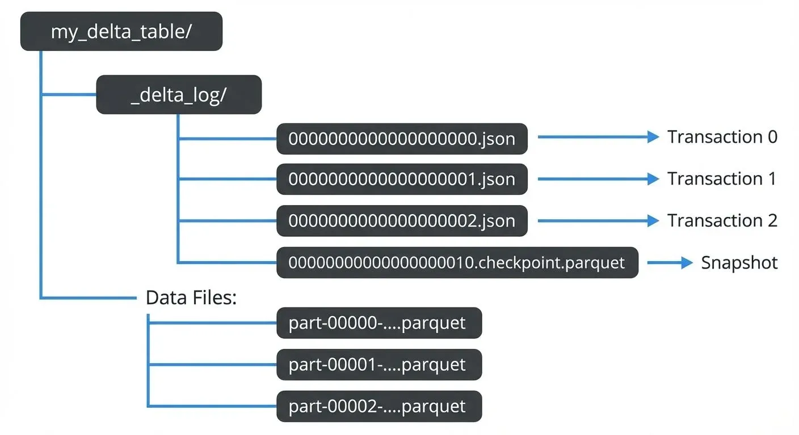

# 1. Flat files vs Parquet

```
Parquet File
│
├── Row Group 1
│   ├── Column: id
│   ├── Column: name
│   ├── Column: city
│   └── Column: salary
│       └── Pages (smallest unit)
│
├── Row Group 2
│   └── ...
│
└── Footer (metadata)
```
Column pruning,

Predicate pushdown


```python
data = [
    (1, "John", 30, "PL"),
    (2, "Anna", 25, "DE"),
    (3, "Peter", 40, "UK"),
    (4, "Mark", 35, "PL")
]

df = spark.createDataFrame(
    data,
    ["id", "name", "age", "country"]
)

display(df)
```

```python
df.write \
    .mode("overwrite") \
    .csv("/tmp/demo/csv")
```

```python
df.write \
    .mode("overwrite") \
    .parquet("/tmp/demo/parquet")
```

```python
display(dbutils.fs.ls("/tmp/demo/csv"))
display(dbutils.fs.ls("/tmp/demo/parquet"))
```

# 2. File Format vs Table Format

## File format

```text
CSV
JSON
Parquet
ORC
Avro
```

## Table format


```text
Delta Lake
Apache Iceberg
Apache Hudi
```


## Parquet jako tabela

```sql
CREATE TABLE users (
    id BIGINT,
    name STRING,
    age INT
)
USING PARQUET;
```


# 3. Apache Iceberg




```python
data = [
    (1, "Jan", "Poland", 30),
    (2, "Anna", "Germany", 25),
    (3, "Piotr", "Poland", 40),
]

columns = ["id", "name", "country", "age"]

df = spark.createDataFrame(data, columns)

df.show()
```
```python
df.write \
    .format("iceberg") \
    .mode("overwrite") \
    .saveAsTable("demo.customers_iceberg")

```


# 4. Delta Lake






```python
df.write \
    .format("delta") \
    .mode("overwrite") \
    .saveAsTable("demo.customers_delta")

display(dbutils.fs.ls(path))

```

---

# 5. Delta vs Iceberg

https://aws.amazon.com/blogs/big-data/choosing-an-open-table-format-for-your-transactional-data-lake-on-aws/

* ACID transactions
* schema evolution
* snapshots
* time travel
* UPDATE
* DELETE
* MERGE
* metadata management


## UniForm
```sql
ALTER TABLE demo.customers_uniform
SET TBLPROPERTIES (
    'delta.universalFormat.enabledFormats' = 'iceberg'
);
```


# 6. Fizyczna struktura Delta w Azure Blob / ADLS

Załóżmy, że mamy:

```text
abfss://data@storage.dfs.core.windows.net/customers/
```

Po zapisaniu Delta możemy zobaczyć coś podobnego:

```text
customers/
│
├── _delta_log/
│   ├── 00000000000000000000.json
│   ├── 00000000000000000001.json
│   └── ...
│
├── part-00000-....parquet
├── part-00001-....parquet
└── part-00002-....parquet
```

Czyli:

### Parquet

```text
part-....parquet
```

zawiera faktyczne dane.

### `_delta_log`

```text
_delta_log/
```

zawiera informacje potrzebne do zarządzania tabelą Delta.

---

# 7. `_delta_log`

To jeden z najważniejszych elementów Delty.

Przykładowo:

```text
_delta_log/
    00000000000000000000.json
    00000000000000000001.json
    00000000000000000002.json
```

Możemy myśleć o tym jak o historii kolejnych commitów tabeli.

Na przykład:

```text
Version 0
    ↓
CREATE TABLE / initial write

Version 1
    ↓
INSERT

Version 2
    ↓
UPDATE

Version 3
    ↓
DELETE
```

---

## Możemy podejrzeć log

```python
display(
    spark.read.text(
        path + "/_delta_log/00000000000000000000.json"
    )
)
```

Możemy zobaczyć informacje takie jak:

```text
add
remove
metaData
protocol
commitInfo
```

Nie trzeba jeszcze znać szczegółowego znaczenia każdego pola.

Najważniejsze jest zrozumienie:

> `_delta_log` pozwala Delcie wiedzieć, jaki jest stan tabeli i jakie operacje zostały wykonane.

---

# 9. ACID

Delta daje nam transakcyjność.

ACID:

### Atomicity

Operacja jest wykonana jako całość albo nie zostaje zatwierdzona.

### Consistency

Tabela przechodzi między poprawnymi stanami.

### Isolation

Równoczesne operacje nie powinny widzieć przypadkowo częściowo zapisanych zmian.

### Durability

Po zatwierdzeniu transakcji dane są trwałe.

---

# 10. Wersjonowanie

Załóżmy:

```text
Version 0

id | name
---|------
1  | John
2  | Anna
```

Wykonujemy:

```sql
UPDATE users
SET name = 'Johnny'
WHERE id = 1;
```

Powstaje nowa wersja:

```text
Version 1

id | name
---|-------
1  | Johnny
2  | Anna
```

Nie traktujemy tego jako:

```text
"zmieniliśmy jeden plik i koniec"
```

Delta ma historię kolejnych stanów tabeli.

---

# 11. Time Travel

Możemy zobaczyć historię:

```sql
DESCRIBE HISTORY delta.`/tmp/demo/users`;
```

Przykładowo:

```text
version | operation
--------|----------
0       | WRITE
1       | UPDATE
2       | DELETE
```

Możemy odczytać konkretną wersję:

```python
old_df = spark.read \
    .format("delta") \
    .option("versionAsOf", 0) \
    .load(path)

display(old_df)
```

oraz aktualną:

```python
current_df = spark.read \
    .format("delta") \
    .load(path)

display(current_df)
```

Dzięki temu możemy zobaczyć:

```text
Version 0
    ↓
Version 1
    ↓
Version 2
    ↓
Current
```

To jest właśnie **Time Travel**.

---


# 20. Schema enforcement

Delta pilnuje schematu tabeli.

Załóżmy:

```text
id       BIGINT
name     STRING
age      INT
```

Próbujemy dopisać dane o niepasującym schemacie.

Delta może odrzucić operację zamiast po prostu pozwolić na przypadkowe zmieszanie struktur.

To nazywamy:

**schema enforcement**

Czyli:

> tabela chroni swój schemat.

---

# 21. Schema evolution

Czasami jednak chcemy świadomie zmienić schemat.

Mamy:

```text
id
name
age
```

a chcemy dodać:

```text
email
```

Możemy wykorzystać kontrolowaną ewolucję schematu:

```python
new_df.write \
    .format("delta") \
    .mode("append") \
    .option("mergeSchema", "true") \
    .save(path)
```

Wtedy schemat może zostać rozszerzony:

```text
id
name
age
email
```

# 22. Kompletny demo flow

Całe demo możemy zrobić jako jeden spójny eksperyment.

### Krok 1 — tworzymy DataFrame

```python
data = [
    (1, "John", 30, "PL"),
    (2, "Anna", 25, "DE"),
    (3, "Peter", 40, "UK")
]

df = spark.createDataFrame(
    data,
    ["id", "name", "age", "country"]
)
```

### Krok 2 — zapisujemy jako Delta

```python
path = "/tmp/demo/users"

df.write \
    .format("delta") \
    .mode("overwrite") \
    .save(path)
```

### Krok 3 — oglądamy Storage

```python
display(dbutils.fs.ls(path))
```

Pokazujemy:

```text
_delta_log
part-....parquet
```

### Krok 4 — dodajemy rekord

```sql
INSERT INTO delta.`/tmp/demo/users`
VALUES (4, 'Mark', 35, 'PL');
```

### Krok 5 — sprawdzamy historię

```sql
DESCRIBE HISTORY delta.`/tmp/demo/users`;
```

### Krok 6 — wykonujemy UPDATE

```sql
UPDATE delta.`/tmp/demo/users`
SET age = 36
WHERE id = 4;
```

### Krok 7 — ponownie sprawdzamy historię

```sql
DESCRIBE HISTORY delta.`/tmp/demo/users`;
```

Pokazujemy:

```text
Version 0 → WRITE
Version 1 → WRITE / INSERT
Version 2 → UPDATE
```

### Krok 8 — Time Travel

```python
old_df = spark.read \
    .format("delta") \
    .option("versionAsOf", 1) \
    .load(path)

display(old_df)
```

oraz:

```python
current_df = spark.read \
    .format("delta") \
    .load(path)

display(current_df)
```

I pokazujemy juniorowi:

```text
Version 1                  Version 2

Mark | 35                  Mark | 36
          → UPDATE →
```

To powinno być główne demo tego spotkania.

---

# 23. Jak wszystko połączyć w jedną całość?

Najważniejszy obraz:

```text
                 DATA
                  │
        ┌─────────┴─────────┐
        │                   │
   CSV / JSON            Parquet
   file formats         file format
                            │
                            ↓
                    ┌───────────────┐
                    │  TABLE FORMAT │
                    └───────┬───────┘
                            │
                     ┌──────┴──────┐
                     │             │
                   Delta        Iceberg
                     │             │
                     ↓             ↓
                 Parquet       Parquet
                  files          files
                     │             │
              + metadata      + metadata
              + transactions  + transactions
              + snapshots     + snapshots
              + etc.          + etc.
```

A nad tym mamy katalog:

```text
          CATALOG / METASTORE
                  │
          ┌───────┴────────┐
          │                │
    Hive Metastore    Unity Catalog
          │                │
          └───────┬────────┘
                  ↓
               TABLE
                  │
          ┌───────┼────────┐
          ↓       ↓        ↓
       Parquet   Delta   Iceberg
```

**To są różne pojęcia i nie należy ich mieszać.**

---


```text

```
